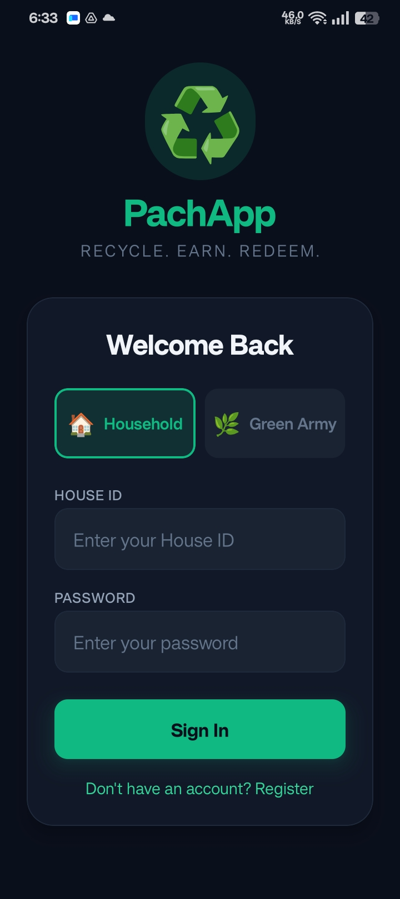
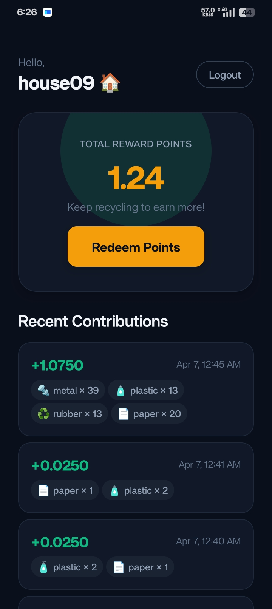
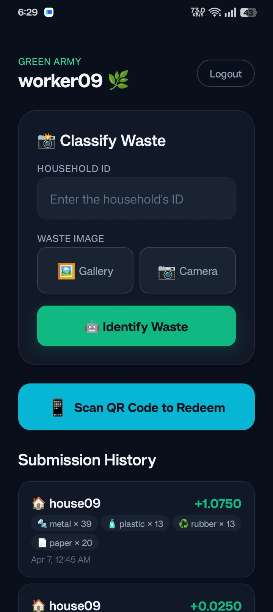
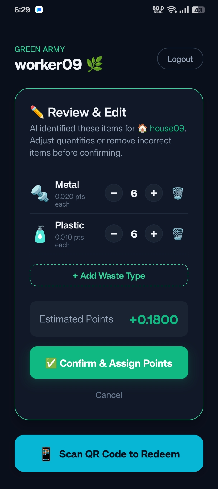
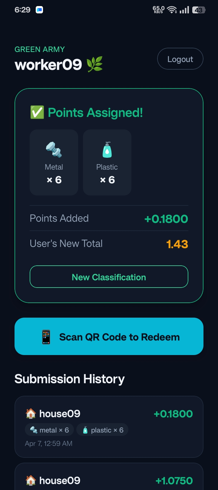

# PachApp — Waste Recycling Reward System

## Problem Statement
Effective household waste management is a persistent challenge. There is a lack of structured incentives for residents to properly sort and dispose of waste, leading to inefficiencies in recycling collection and processing.

## Project Description
PachApp is a mobile application that encourages household waste recycling through an incentive-based reward system. A dedicated team called the **Green Army** collects waste from houses, verifies it using AI image classification, and assigns reward points based on the type and quantity of the waste. Users accumulate these points and can later redeem them through a QR-based system, making waste management rewarding and transparent.

---

## Google AI Usage
### Tools / Models Used
- Google Vertex AI (Gemini 2.0 Flash)

### How Google AI Was Used
Google Vertex AI is integrated into the Python FastAPI backend to automatically classify images of household waste submitted by the Green Army. When a worker uploads a picture of the collected waste, the Gemini model processes the image to identify the waste type (e.g., Plastic, Metal, Paper, E-Waste) and estimates the quantity. This classification directly drives the logic that calculates and assigns reward points to the corresponding household, completely automating the verification process and minimizing human error.

---

## Proof of Google AI Usage



---

## Screenshots 







---

## Demo Video
Upload your demo video to Google Drive and paste the shareable link here(max 3 minutes).
[Watch Demo](https://drive.google.com/file/d/1gaR_rvAfCOy4jN6LcBqtGvdB2NstCXwd/view?usp=drivesdk)

---

## Installation Steps

```bash
# Clone the repository
git clone https://github.com/Joshua-0021/pachapp.git

# Go to project folder
cd pachapp

# --- 1. Backend Setup ---
cd backend

# Create and activate virtual environment
python -m venv venv
venv\Scripts\activate       # Windows
# source venv/bin/activate  # macOS/Linux

# Install dependencies
pip install -r requirements.txt

# Start the server (runs on localhost:8000)
uvicorn app.main:app --reload --host 0.0.0.0 --port 8000


# --- 2. Frontend Setup (Open a new terminal) ---
# Navigate to frontend from project root
cd ../frontend

# Install dependencies
npm install

# Start the Expo development server
npx expo start
```
